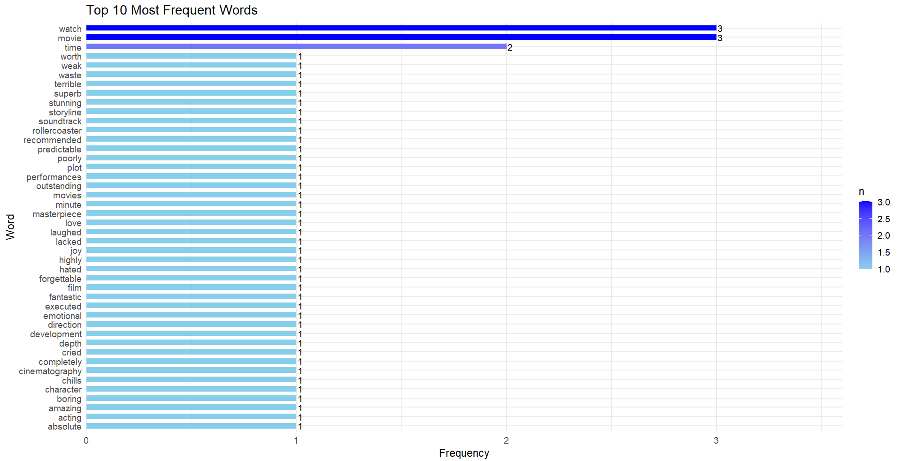
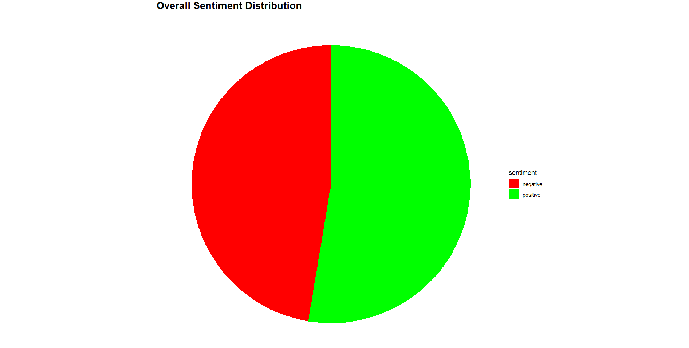

# Sentiment Analysis of Movie Reviews

This project demonstrates an **advanced Sentiment Analysis** pipeline in **R** that analyzes movie reviews, classifies them as **positive** or **negative**, and visualizes sentiment distribution using multiple plots. The project now also incorporates the **NRC Emotion Lexicon** to detect **emotions** (e.g., joy, anger, sadness) and uses **word clouds** and **pie charts** for better insights.

---

## Overview

Sentiment Analysis is an NLP technique that identifies emotional tone in text.  
In this project:  
- Movie reviews are cleaned and tokenized.  
- Words are classified as **positive** or **negative** using the **Bing lexicon**.  
- **Emotions** (joy, anger, trust, fear, etc.) are detected using the **NRC lexicon**.  
- Results are visualized with **ggplot2**, including **faceted bar charts, word clouds, and sentiment pie charts**.

These analyses reveal how viewers express opinions about movies through their word choices.

---

## Example Outputs

The updated project generates multiple **visual insights**:

- **Top 10 Most Frequent Words**  
- **Positive vs. Negative Words (Bar Chart)**  
- **Word Clouds for Sentiment Words**  
- **Overall Sentiment Distribution (Pie Chart)**  
- **Emotion Distribution (NRC Lexicon)**  

### Sample Visualizations:





---

## Key Features

**Tokenization & Stop-word Removal**  
**Sentiment Classification** using **Bing lexicon**  
**Emotion Analysis** using **NRC lexicon**  
**Data Visualization** with:
   - Faceted Bar Charts  
   - Word Clouds  
   - Sentiment Pie Chart  
   - Emotion Distribution  

---

## Technologies Used

- **R Programming Language**  
- **tidyverse** – Data manipulation & plotting  
- **tidytext** – Text mining  
- **textdata** – Sentiment & emotion lexicons  
- **wordcloud** – Word cloud generation  
- **RColorBrewer** – Enhanced color palettes  

---

## Installation & Requirements

### Software
- [R](https://cran.r-project.org/) (version 4.0 or later)
- [RStudio](https://posit.co/download/rstudio-desktop/) (recommended)

### Install Required R Packages

```R
install.packages("tidyverse")   # Data manipulation and plotting
install.packages("tidytext")    # Text mining
install.packages("textdata")    # Sentiment lexicons
```

---

### Results & Insights
- Positive words (e.g., love, fantastic, masterpiece) dominate favorable reviews.
- Negative words (e.g., boring, weak, terrible) occur in unfavorable ones.
- Emotion analysis reveals nuanced sentiments like joy, anger, and sadness.
- Word clouds highlight the most impactful sentiment words visually.

---

### Future Enhancements
- Use a larger dataset of real-world reviews
- Implement interactive Shiny dashboard
- Add machine learning models for predictive sentiment analysis
- Integrate with real-time review streams (e.g., Twitter API)


